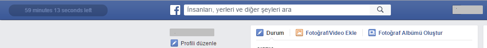
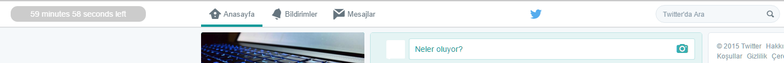
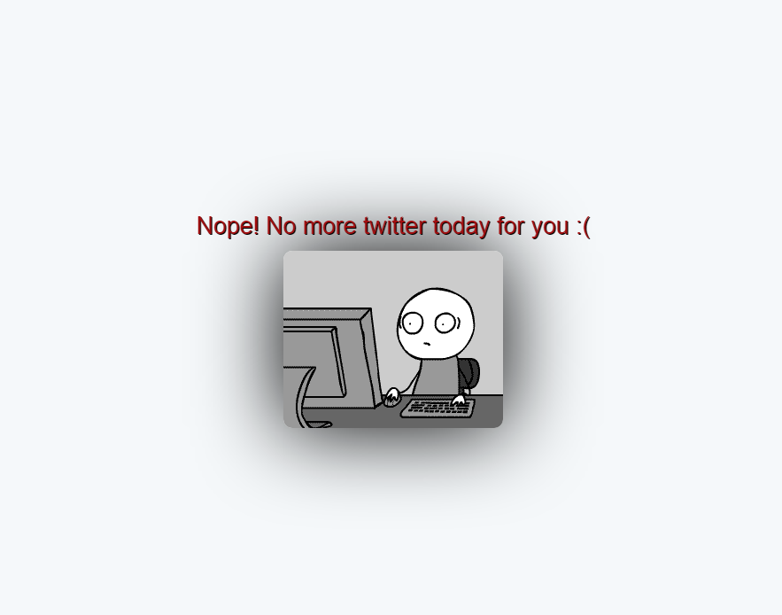
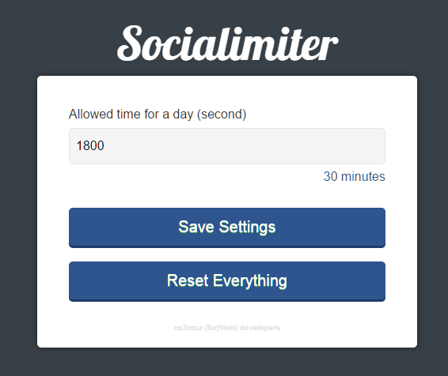

Chrome extension that limits social network. You allowed some time to use. If you use all your time then, you can't use network anymore. You need to wait 12pm

You can download it from [chrome web store](https://chrome.google.com/webstore/detail/socialimiter/ooiolpeekfcgicfhjdpnbkfbmnealpbo)

Features
--------------

* Remaining time
During the time spent on the site, on left corner you see brand that how much time remaining today for that site.

* Sync with google account
Automaticly sync with all browsers that has your google account. Your remaining time always stored in google servers.

* Changeable time
You can easily change your time spent. If you want to spent only 10 minutes per day, change the allowed time to 10 * 60 => 600 seconds.
> You can't give a number that sorter then 1 minutes and longer then 1 day.

* Clear everything
If you want to reset remaining time, you can do that but please stop using that button :(

* Multi-Language Support
We support English and Turkish. But all code designed to support more. Thanks `chrome.i18n`

* No dependency
Lightweight and no dependency required.

* Only works for active tabs
Counter stops when you jump another tab. If you come back counter starts again.

* Seperated times
Every social site has own time.

Screenshots
---------------

facebook timer running

-----------

twitter timer running

-----------

there is no time to spent, nope screen

----------

settings screen

